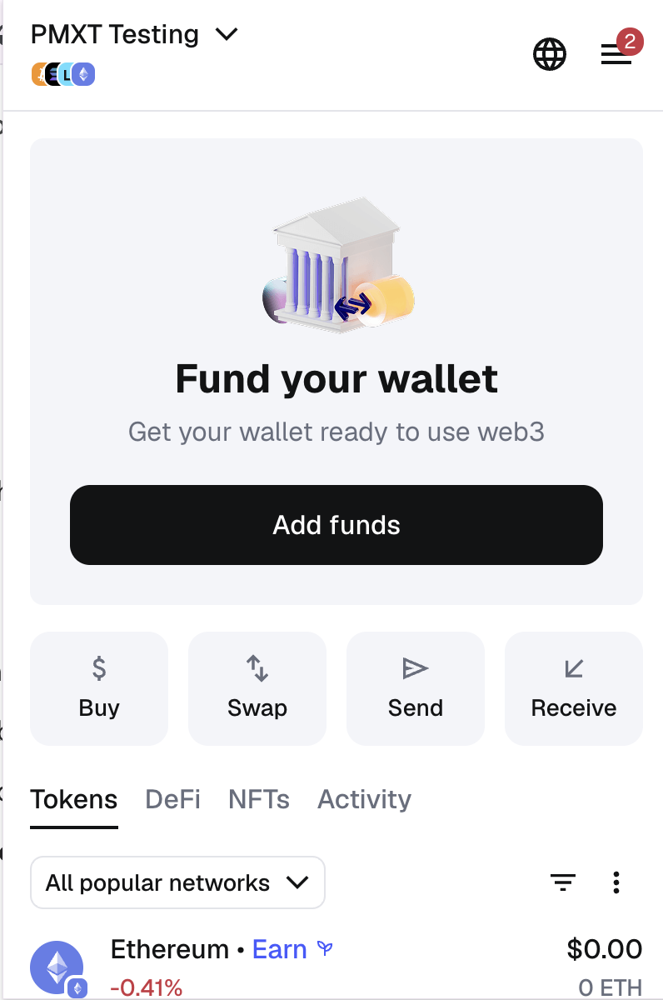
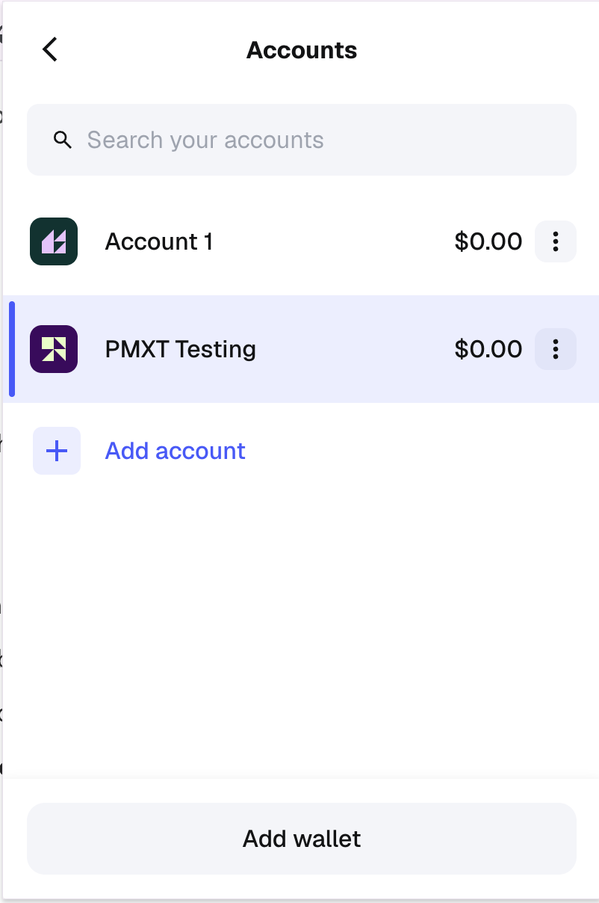
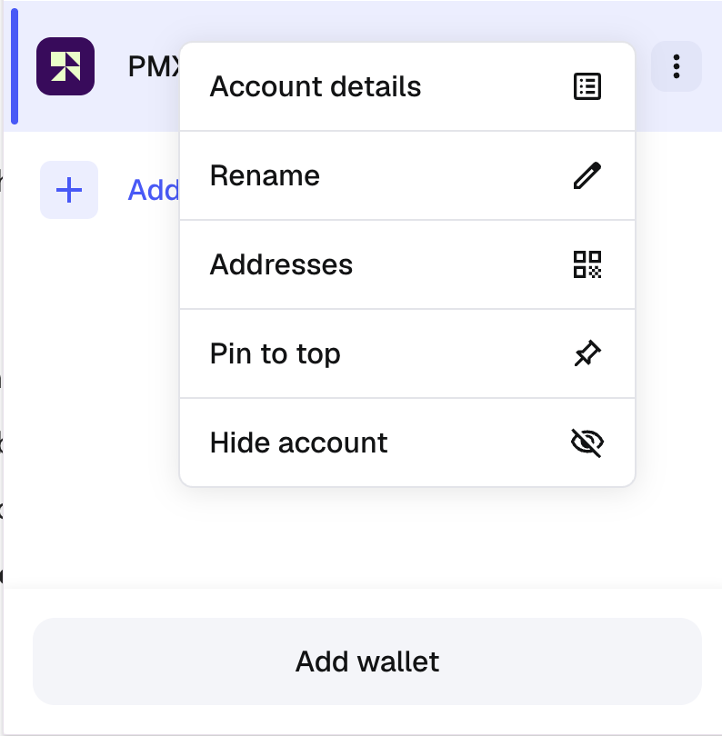
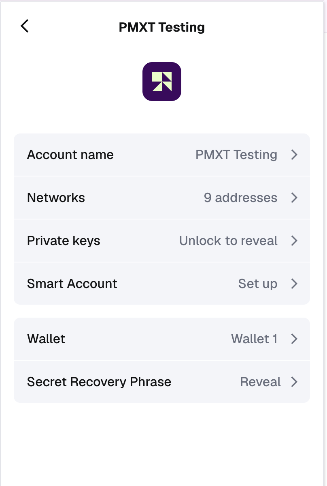
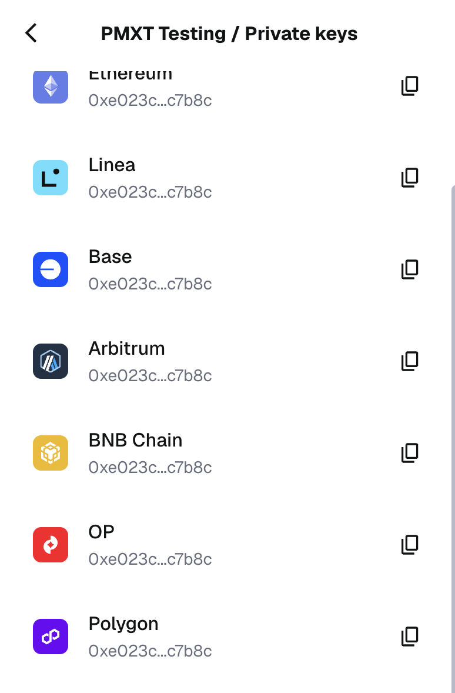

# Polymarket Setup Guide

To trade on Polymarket via the API, you need your **Polygon Private Key**.

## How to export your Private Key (MetaMask)

1. **Open the Account Menu**  
   Click the top-left icon (or account selector) to view your accounts.  
   

2. **Open Account Options**  
   Click the three dots ("...") next to the account you want to use.  
   

3. **Access Account Details**  
   Select "Account Details".  
   

4. **Reveal Private Key**  
   Click "Show Private Key" and unlock your wallet.  
   

5. **Copy the Key**  
   Copy the private key string.  
   

## Configuration

Add the key to your `.env` file in the project root:

```bash
POLYMARKET_PRIVATE_KEY=0x...
```

*Note: Ensure the key starts with `0x`. If it does not, prefix 0x manually.*
